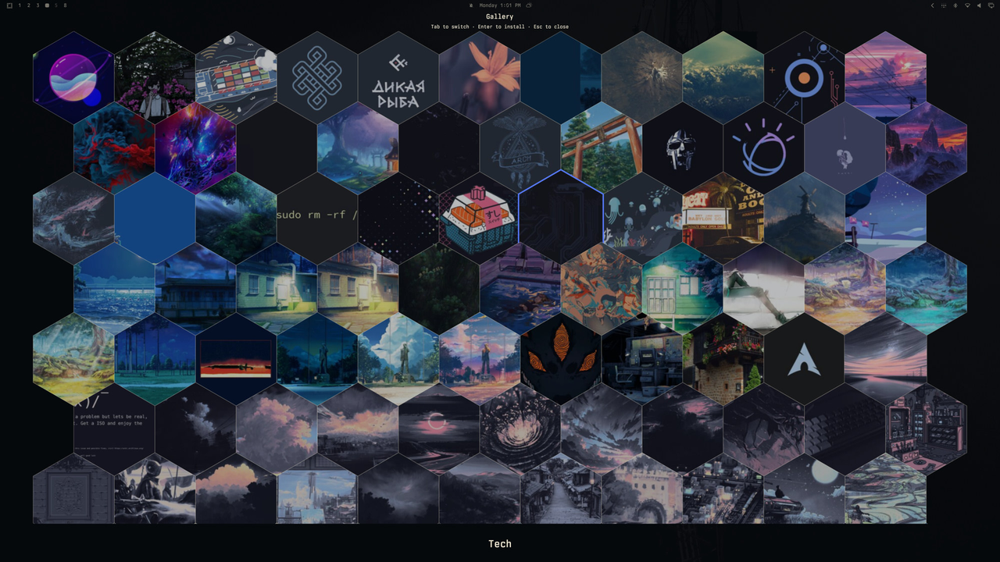

# Grid wallpaper picker

Grid wallpaper picker for [Omarchy](https://omarchy.org/). Pick installed themes, the current theme’s backgrounds, or install from the [bjarneo/omarchy-themes](https://bjarneo.github.io/omarchy-themes/) gallery.



Demo: [grid wallpaper picker on X](https://x.com/rblalock/status/2094399974675034339)

## Install

```sh
omarchy plugin add https://github.com/rblalock/omarchy-grid-wallpaper-picker.git --enable
```

Then make it launchable without a custom key (pick one or both):

```sh
PLUGIN="$HOME/.config/omarchy/plugins/rblalock.grid-wallpaper-picker"
cp "$PLUGIN/rblalock.grid-wallpaper-picker.desktop" ~/.local/share/applications/
```

Search **Grid wallpaper picker** in the Omarchy app launcher. To also put it under Style in the Omarchy menu, merge `omarchy-menu.jsonc` from the plugin into `~/.config/omarchy/extensions/omarchy-menu.jsonc`.

Optional keybinds in `~/.config/hypr/bindings.lua`:

```lua
o.bind("SUPER + ALT + T", "Grid wallpaper picker", "omarchy-shell shell summon rblalock.grid-wallpaper-picker '{\"mode\":\"themes\"}'")
o.bind("SUPER + ALT + B", "Grid background picker", "omarchy-shell shell summon rblalock.grid-wallpaper-picker '{\"mode\":\"backgrounds\"}'")
hl.layer_rule({ match = { namespace = "^omarchy-grid-wallpaper-picker$" }, no_anim = true, animation = "none" })
```

```sh
omarchy-shell shell rescanPlugins
```

## Dependencies

Omarchy already ships these on a normal install:

- `python3` — gallery index, apply, and thumb prefetch
- `curl` — gallery thumb helper
- `vipsthumbnail` (libvips) — local theme and background thumbs

The gallery talks to `https://bjarneo.github.io` (catalog) and `https://wallpapers.hel1.your-objectstorage.com` (media). Downloads are HTTPS-only, host-allowlisted, and byte-capped. Applying a gallery item writes a user theme under `~/.config/omarchy/themes/<slug>/` only after you pick it. Everything runs as your user.

## Usage

Summon:

```sh
omarchy-shell shell summon rblalock.grid-wallpaper-picker '{"mode":"themes"}'
```

| Input | Action |
| --- | --- |
| App launcher / Style → Grid wallpaper picker | Open |
| `Tab` | Themes → Backgrounds → Gallery |
| Type | Filter |
| `Enter` | Apply. In Gallery: first Enter flips the hex (Palette selected), second Enter installs |
| Click a flipped ramp | Install that palette (Warm / Cool / Material / Aether) |
| Arrows (while flipped) | Move among palettes |
| Right-click (gallery) | Same palettes in a menu |
| Right-click (user theme) | Delete (`omarchy theme remove`) |
| `Esc` | Close |

Gallery palettes are precomputed in the catalog (Aether already ran upstream). This plugin does not run Aether.

Installed gallery items become normal user themes under `~/.config/omarchy/themes/<slug>/`.

## Remove

```sh
omarchy plugin remove rblalock.grid-wallpaper-picker --yes
rm -f ~/.local/share/applications/rblalock.grid-wallpaper-picker.desktop
```

Gallery-installed themes stay until `omarchy theme remove <slug>`. Cache: `rm -rf ~/.cache/omarchy/grid-wallpaper-picker`.

The gallery grid opens from `~/.cache/omarchy/grid-wallpaper-picker/gallery.json` immediately. If that index is older than 24 hours, a refresh runs in the background and the grid updates in place.

## Validate

```sh
omarchy plugin validate .
qmllint -I "$OMARCHY_PATH/shell" HexPicker.qml HexCell.qml
```

## Credits

- Omarchy / Quickshell overlay contract
- Catalog and media: [bjarneo/omarchy-themes](https://github.com/bjarneo/omarchy-themes)
- Download hardening and apply path adapted from [gotar/omarchy-themes](https://github.com/gotar/omarchy-themes) (MIT)

Wallpapers remain under their original licenses as provided by that collection.
